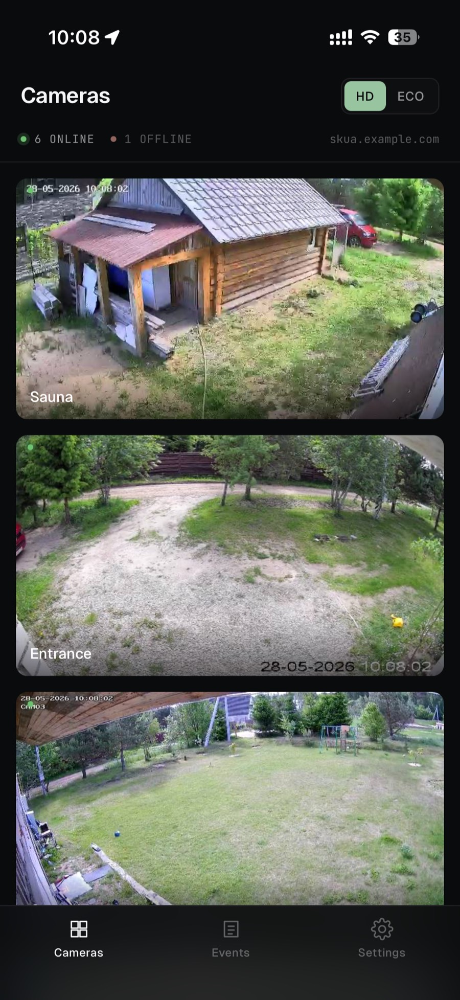
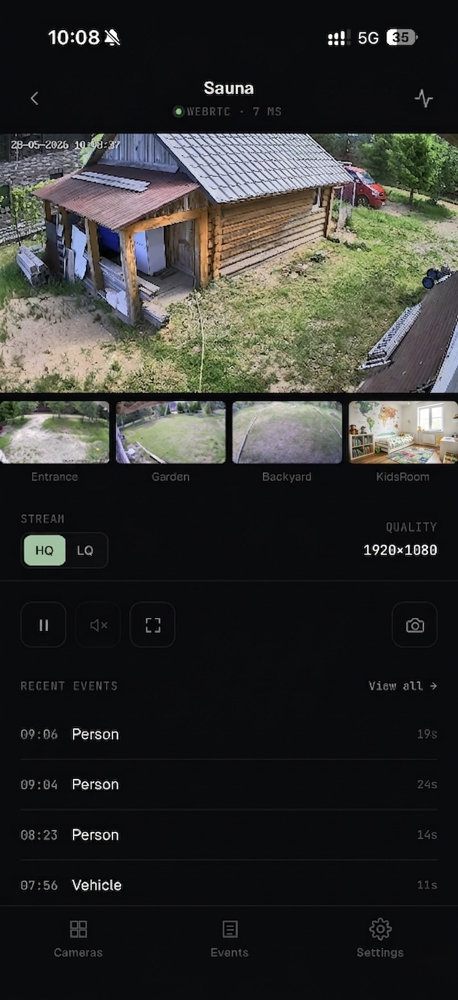
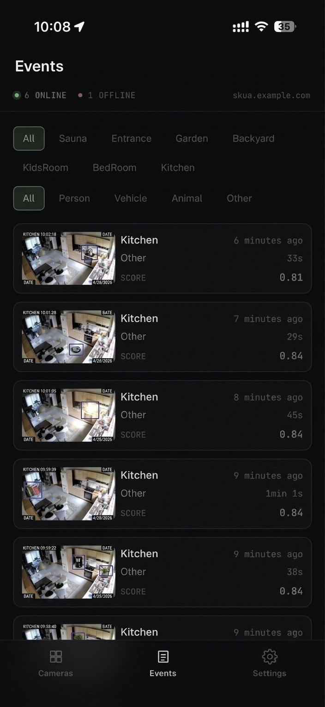
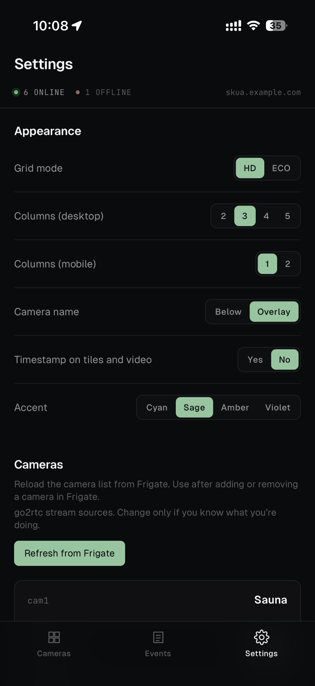
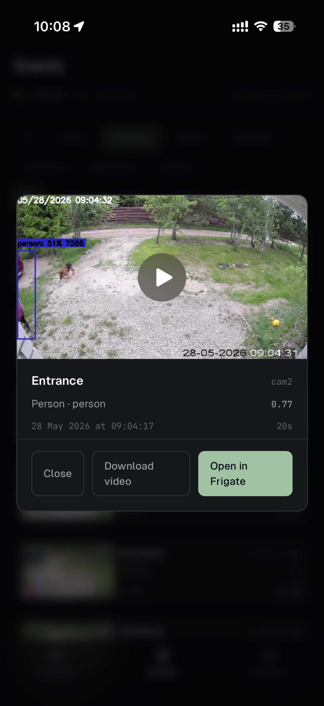

# Skua

Self-hosted Progressive Web App for Frigate NVR. WebRTC-first,
iOS-optimised, LAN-only by design.

Skua is a focused live + events client for [Frigate](https://frigate.video).
It is built for households running Frigate at home that want a faster,
more stable day-to-day viewing experience — especially from an iPhone
home-screen PWA — without replacing Frigate's own UI for admin,
recording browser, or Explore. It is not a multi-tenant product, not a
Frigate UI replacement, and not designed to be exposed to the public
internet on its own.

## ⚠️ Security and access model

> **Skua has no application-level login. By design.**
>
> It expects to run on a trusted local network. The default deployment
> is reachable at the Docker host's address — nothing more.
>
> Putting Skua on the public internet without your own auth layer
> (reverse proxy with auth, VPN, or zero-trust tunnel) is unsafe and
> unsupported. Threat model and hardening recommendations live in
> [SECURITY.md](SECURITY.md).

## Why Skua and not Frigate's PWA

Frigate's own PWA is excellent for everything-Frigate — admin tasks,
the Explore view, history scrubbing, the recording browser, settings.
It is the right tool for that and Skua does not try to replace it.

Skua is built for the day-to-day "check the cameras quickly"
pattern, especially on iOS, where Frigate's MSE-based grid has
documented stability issues (MSE timeouts, slow first paint on install).
Skua replaces only that workflow — WebRTC for the focus view,
JPEG snapshots for the grid, inline HEVC clip playback for events — and
ships as a single static binary under 9 MB.

## Features

- Live single-camera focus view via WHEP (sub-500 ms latency).
- Multi-camera grid with HD/ECO snapshot modes (1 Hz JPEG tiles,
  server-side resize for ECO).
- Real-time events list with cam, kind, and group filters plus
  infinite scroll.
- Inline event clip playback that works on iOS Safari (HEVC
  `hev1`→`hvc1` retag plus a Range-aware LRU cache).
- Camera groups with an in-app editor (single-membership, YAML-backed).
- Per-camera friendly names persisted server-side.
- Per-camera go2rtc stream-source overrides editable from `/settings`.
- Dynamic camera discovery from Frigate (refresh-on-demand with SSE
  `camera.added` / `camera.removed` events).
- Audio: runtime-detected per camera, not from static config.
- PWA install on iOS and Android home screens with an offline shell.
- Server-side persisted preferences (no `localStorage`, prefs sync
  across devices in the household).
- Talk-back capability flag honoured per camera (UI gated on
  per-camera capability).
- Single static binary, ~9 MB Docker image, distroless runtime.

## Screenshots

Mobile PWA, installed to the iOS home screen.

<p align="center">
  
  
  
</p>
<p align="center">
  
  
</p>

## Requirements

- Frigate 0.17.1 (commit `416a9b7` verified). Skua talks to
  Frigate's internal API on port `:5000` (no auth) and to go2rtc on
  port `:1984`. The authed UI port `:8971` is not used.
- go2rtc 1.9.10 (ships with Frigate 0.17).
- Docker and Docker Compose v2 on the host (Linux, x86_64 or aarch64).
- A trusted LAN where the Docker host is reachable from the client
  devices that will use Skua.
- Each camera needs an H.264 go2rtc stream for the focus view (iOS
  Safari WebRTC does not play H.265), pointed at by `live.streams.Main`
  in the Frigate config. The go2rtc alias name is your choice, not a
  required pattern (see
  [docs/setup/frigate-config.md](docs/setup/frigate-config.md) for the
  stream-source and ICE-candidates setup).
- Optional: a reverse proxy with HTTPS if you want iPhone
  home-screen install (PWA install requires TLS).

## Quick start

### Run with Docker Compose

1. Create a directory for Skua and a `compose.yaml` with the
   following contents. Replace `http://frigate:5000` with whatever
   hostname or IP resolves to your Frigate container (if Frigate runs
   in the same Docker network, `frigate` is enough).

   ```yaml
   services:
     skua:
       image: ghcr.io/skua-app/skua:latest
       container_name: skua
       restart: unless-stopped
       ports:
         - "3200:3200"
       environment:
         FRIGATE_URL: "http://frigate:5000"
         GO2RTC_URL: "http://frigate:1984"
       volumes:
         - ./data:/data
   ```

2. Start the container:

   ```bash
   docker compose up -d
   ```

3. Open `http://<docker-host>:3200` from a device on the same network.
   The grid should populate within a second or two as cameras come
   online.

If the grid is empty or all cameras show offline, check the
Troubleshooting section below.

### With HTTPS and a friendly hostname (optional)

If you want iPhone home-screen install, a real TLS cert, or a friendly
URL like `skua.example.com` instead of an IP, put Skua behind
a reverse proxy. See
[docs/setup/npm-proxy.md](docs/setup/npm-proxy.md) for an example with
Nginx Proxy Manager and
[docs/setup/pihole-dns.md](docs/setup/pihole-dns.md) for a local-DNS
example with Pi-hole. Any reverse proxy works.

## Configuration

Skua reads its configuration from environment variables. Full
descriptions live in [.env.example](.env.example). The table below is
the canonical reference.

| Variable | Default | Required | Notes |
|---|---|---|---|
| `FRIGATE_URL` | — | Yes | Frigate internal API base URL. Use port 5000 (no auth), not `:8971` (the authed UI port). |
| `FRIGATE_UI_URL` | falls back to `FRIGATE_URL` | No | Public URL of the Frigate UI, used for "Open in Frigate" deep-links from the events list. Must be reachable from the user's device. |
| `GO2RTC_URL` | — | No | go2rtc REST API for WHEP signaling. Optional in E1; BFF starts without it. |
| `PORT` | `3200` | No | Port the BFF listens on. |
| `LOG_LEVEL` | `info` | No | `debug` / `info` / `warn` / `error`. |
| `LOG_FORMAT` | `json` | No | `json` / `text`. |
| `SNAPSHOT_CACHE_TTL` | `15s` | No | Cache TTL for upstream Frigate snapshot fetches. |
| `HTTP_TIMEOUT` | `5s` | No | Default timeout for outbound HTTP calls. |
| `SHUTDOWN_TIMEOUT` | `10s` | No | Graceful-shutdown grace period. |
| `WHEP_TIMEOUT` | `10s` | No | Upstream timeout for go2rtc WHEP signalling. |
| `STREAM_PROXY_TIMEOUT` | `0` | No | `0` disables timeout, allowing indefinite streaming. |
| `PREFS_PATH` | `/data/prefs.json` | No | File-backed user prefs store. |
| `GROUPS_CONFIG_PATH` | `/data/groups.yaml` | No | Camera-group YAML; auto-created on first `POST /api/groups`. |
| `CAMERA_NAMES_CONFIG_PATH` | `/data/camera_names.yaml` | No | Per-camera display name overrides; auto-created on first `PUT /api/camera-names/{cam_id}`. Cameras without an entry fall back to the Frigate-sourced name from `cameras.yaml`. |
| `CAMERAS_CONFIG_PATH` | `/data/cameras.yaml` | No | Camera registry persisted from Frigate config; auto-created at first startup when Frigate is reachable. Used as a fallback snapshot when Frigate is unreachable on subsequent starts. |
| `CAPABILITIES_CONFIG_PATH` | `/data/capabilities.yaml` | No | Per-camera `talk_back` / `ptz` overrides — not exposed by Frigate's config, hand-edited on the host until a future editor lands. |
| `STREAM_OVERRIDES_CONFIG_PATH` | `/data/stream_overrides.yaml` | No | Per-camera go2rtc stream-name overrides; applied only inside the WHEP handler. `GET /api/cameras` still surfaces Frigate-truth stream names. |

All `_PATH` variables are container-side paths. The default
`./data:/data` volume mount in the Quick Start compose maps them all
under a single host directory. That host directory must be writable by
the container's non-root uid (65532) — see the
[Container won't start / data folder stays empty](#container-wont-start--data-folder-stays-empty)
troubleshooting note below.

## Build from source

### Backend (Go)

```bash
cd backend
go run ./cmd/server     # runs against FRIGATE_URL from env
make check              # gofmt + go vet + golangci-lint + go test -race
```

Go 1.25 or newer required.

### Frontend (SvelteKit)

```bash
cd frontend
npm install
npm run dev             # Vite dev server on :5173, proxies /api/* to :3200
npm run build           # produces build/, embedded into the Go binary
npm run check           # svelte-check + tsc
```

Node 20 or newer required.

### Full Docker build

```bash
docker build -t skua:local .
docker run --rm -e FRIGATE_URL=http://<frigate-host>:5000 -p 3200:3200 skua:local
```

The Dockerfile produces a distroless single-binary image around 9 MB.

## Limitations

- No application-level authentication. You own the auth layer (see
  Security above).
- LAN-only by default. Remote access is your responsibility.
- The talk-back feature requires per-camera support — Hikvision SKUs
  without the web management surface cannot talk back from the browser
  (see [docs/hikvision-no-web-sku.md](docs/hikvision-no-web-sku.md)).
- Grid view is JPEG snapshots, not live video, by design — focus view
  is one tap away. Live grid was prototyped and removed (preserved in
  git history).
- WebRTC live view requires H.264-baseline aliases in go2rtc — iOS
  Safari rejects High profile streams advertised as Baseline (see
  [docs/setup/frigate-config.md](docs/setup/frigate-config.md)).
- Single static camera registry per Frigate instance — multi-Frigate
  aggregation is not supported.
- Designed for small households (2-4 users typically). Not a
  multi-tenant product.

## Troubleshooting

### Container won't start / data folder stays empty

The Skua image is built on `gcr.io/distroless/static-debian12:nonroot` and
runs as the `nonroot` user (uid/gid 65532). A freshly created host `./data`
directory is usually owned by `root`, which means the container cannot
write to it — the BFF fails on its first write (`cameras.yaml`,
`prefs.json`, and the other YAML stores) and the data folder is left
empty, so the UI never comes up. The failure shows up in `docker logs
skua` as a `permission denied` write error.

Two ways to fix it:

- **Use a Docker named volume** — let Docker manage ownership for you:

  ```yaml
  volumes:
    - skua-data:/data

  volumes:
    skua-data:
  ```

- **Keep the bind mount and `chown` the host directory once** before
  starting the container:

  ```bash
  mkdir -p ./data
  sudo chown -R 65532:65532 ./data
  docker compose up -d
  ```

`chmod 777 ./data` also works but is broader than necessary and not
recommended on a host you care about — prefer one of the two options
above.

### Grid shows no cameras / all offline

- Verify `FRIGATE_URL` is reachable from inside the Skua
  container:

  ```bash
  docker exec skua wget -qO- http://<frigate-host>:5000/api/stats
  ```

- Check the BFF logs: `docker logs skua`.
- If Frigate was unreachable on first start, Skua fails fast with
  a clear log line — see CLAUDE.md §12 ("Camera registry is loaded
  once at startup").

### PWA not installable on iPhone

- The site must be served over HTTPS. iOS Safari does not offer
  install on plain HTTP.
- It must be opened in Safari directly (not in Chrome or Firefox on
  iOS — they cannot install PWAs).
- The install banner only appears on fresh Safari sessions. Try a
  private tab to verify the manifest is being served.

### Snapshot tile shows a stale image

- Snapshots are served with `Cache-Control: no-store`. A stale frame
  indicates a Frigate or network issue rather than caching.
- Tiles refresh once per second on the client.

### Service worker not updating

- Skua's service worker uses `registerType: 'prompt'` — a new SW
  waits until every tab for the scope is closed before activating. On
  iOS PWA, this means the update lands on the next cold launch from
  the home-screen icon.
- An "App updated" toast confirms the update was applied on the new
  session.

## Documentation

- [CLAUDE.md](CLAUDE.md) — full architecture context (read this if
  you intend to contribute).
- [docs/api-contract.md](docs/api-contract.md) — BFF REST/SSE contract
  with TypeScript-style definitions.
- [docs/ios-clip-playback.md](docs/ios-clip-playback.md) — the three
  iOS Safari constraints on event clip playback.
- [docs/hikvision-no-web-sku.md](docs/hikvision-no-web-sku.md) —
  known-issue case study for the no-web Hikvision SKU.
- [docs/setup/](docs/setup/) — optional host-side setup (reverse
  proxy, local DNS, ICE candidates).
- [docs/epics/](docs/epics/) — historical epic specs.

## Tech stack

Go 1.25 BFF (chi router, `log/slog`, single static binary) plus a
SvelteKit 2 + Svelte 5 (runes) + Tailwind 4 frontend embedded into the
binary. WebRTC via WHEP through go2rtc, no media transcoding inside
Skua. JPEG snapshot tiles resized server-side with
`golang.org/x/image/draw`. PWA via `vite-plugin-pwa` (`generateSW`).
Distroless runtime image around 9 MB.

## Contributing

- License: MIT — see [LICENSE](LICENSE).
- Bug reports, feature requests, and pull requests welcome. Please
  read [CONTRIBUTING.md](CONTRIBUTING.md) before opening a PR.
- Security issues: see [SECURITY.md](SECURITY.md) for responsible
  disclosure.
- Community conduct: [CODE_OF_CONDUCT.md](CODE_OF_CONDUCT.md).

## Acknowledgments

Skua stands on top of [Frigate](https://frigate.video) and
[go2rtc](https://github.com/AlexxIT/go2rtc) — without those projects
this one would not exist. The frontend is built with
[SvelteKit](https://kit.svelte.dev) and
[Tailwind CSS](https://tailwindcss.com). Display fonts are
[Geist](https://vercel.com/font) and
[JetBrains Mono](https://www.jetbrains.com/lp/mono/).
